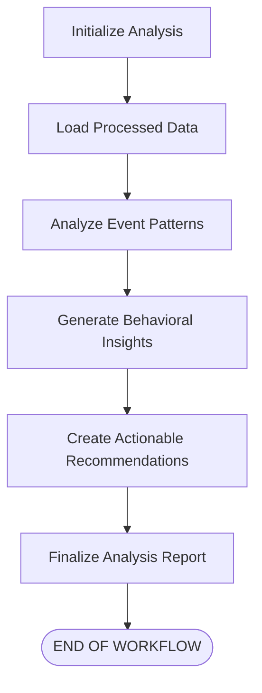

# LangGraph Event Relationship Analysis Agent

## Overview

The `langgraph_agent.py` script implements a sophisticated event relationship analysis agent utilizing the LangGraph framework. This powerful agent processes user event data from a SQLite database, meticulously analyzes event sequences, temporal patterns, and inter-event relationships. Subsequently, it generates valuable behavioral insights and actionable recommendations through a Large Language Model (LLM).

This agent is specifically designed to integrate with data processed by the `DataProcess/data_processor.py` pipeline. The pipeline is responsible for storing user event sequences as structured JSON objects within the `processed_events` table of the database.

## Key Features

-   **Stateful Workflow**: Employs LangGraph's `StateGraph` to construct a robust, multi-step, and maintainable analysis process.
-   **Modular Analysis Core**: Features a dedicated `EventRelationshipAnalyzer` class with specialized methods for:
    -   *Event Sequence Analysis*: Identifying common event pathways and critical transition points.
    -   *Temporal Pattern Analysis*: Uncovering patterns related to hourly/daily distributions, session durations, and inter-event time gaps.
    -   *Event Relationship Analysis*: Examining event co-occurrence, frequency, performing funnel analysis, and calculating conversion patterns.
-   **LLM-Powered Insights**: Leverages OpenAI's GPT models (specifically `gpt-4o-mini`) via `langchain-openai` to derive qualitative behavioral insights from the quantitatively analyzed data.
-   **Comprehensive Reporting**: Produces a detailed output including:
    -   A summary of the raw data processed.
    -   Key event pattern statistics (e.g., top event transitions, peak activity hours, average session duration).
    -   Identification of the most frequent events and relevant conversion rates.
    -   AI-generated behavioral insights and narratives.
    -   Clear, actionable recommendations.
-   **Integrated Error Handling**: Includes foundational error handling mechanisms within each stage of the workflow to ensure stability.
-   **Flexible Configuration**: The database path can be easily specified as a parameter when initiating the analysis.

## Agent Workflow

The agent executes a clearly defined sequence of operations orchestrated by LangGraph. Each step transitions its results to the next, building a comprehensive analysis:

1.  **Initialize (`initialize_analysis`)**:
    *   Sets up the initial state for the analysis run.
    *   Establishes the database path, defaulting to `user_events.db` if not otherwise specified.

2.  **Load Data (`load_processed_data`)**:
    *   Connects to the designated SQLite database.
    *   Queries the `processed_events` table to retrieve user data, with a focus on the `event_time_pairs` JSON field.
    *   Transforms the retrieved data into a pandas DataFrame for efficient manipulation.
    *   Includes checks and error handling for scenarios like an empty or inaccessible database.

3.  **Analyze Patterns (`analyze_event_patterns`)**:
    *   Instantiates the `EventRelationshipAnalyzer`.
    *   Systematically invokes its analytical methods:
        *   `analyze_event_sequences()`: Extracts individual user event sequences, calculates transition frequencies between different events, and compiles session-level metrics (e.g., session length, number of unique events).
        *   `analyze_temporal_patterns()`: Computes event distributions across hours and days, determines typical session durations, analyzes time gaps between events, and characterizes user-specific activity rhythms.
        *   `analyze_event_relationships()`: Identifies event co-occurrence patterns, tabulates overall event frequencies, uncovers common event funnels or sequences, and analyzes predefined conversion patterns (e.g., from `app_open` to an engagement event).
    *   Aggregates and stores these multifaceted analytical results in the `event_patterns` field of the workflow state.

4.  **Generate Insights (`generate_behavioral_insights`)**:
    *   Initializes an OpenAI LLM (default: `gpt-4o-mini`).
    *   Prepares a concise, structured summary of the findings from the `event_patterns` stage.
    *   Constructs a tailored prompt instructing the LLM to interpret the data summary and identify:
        -   Key behavioral archetypes or user segments.
        -   Significant event relationships and dependencies.
        -   Patterns of user engagement or disengagement.
        -   Potential areas for product or service optimization.
        -   Anomalous or noteworthy findings.
    *   Invokes the LLM with this summarized data and directive.
    *   Captures and stores the LLM's narrative response alongside the summary statistics in the `behavioral_insights` state field.

5.  **Create Recommendations (`create_recommendations`)**:
    *   Generates a set of rule-based, data-driven recommendations based on the `event_patterns` (e.g., addressing low conversion rates, suggesting improvements for short session durations).
    *   Enriches these recommendations by appending the AI-generated analysis from `behavioral_insights`, providing a deeper context.
    *   Stores the consolidated list of actionable recommendations in the `recommendations` state field.

6.  **Finalize Report (`finalize_analysis`)**:
    *   Compiles a concluding summary of the entire analysis process, including metadata like timestamps, the total number of users analyzed, and counts of discovered patterns and generated recommendations.
    *   Formally marks the analysis process as complete within the workflow state.

### Workflow Diagram (Textual Representation)

This diagram illustrates the flow of control and data through the agent's nodes:



## State Management (`AnalysisState`)

The `AnalysisState` TypedDict is the backbone of the LangGraph workflow, facilitating data passage and state tracking across the different nodes. Its key fields include:

-   `messages`: A list of strings, acting as a log to trace the agent's execution path and significant events.
-   `database_path`: A string specifying the file path to the SQLite database.
-   `raw_data`: A pandas DataFrame that holds the `processed_events` data once loaded from the database.
-   `event_patterns`: A dictionary meticulously structured to store the rich output from the `analyze_event_patterns` node. It typically contains sub-dictionaries for `sequences`, `temporal` patterns, and `relationships`.
-   `event_relationships`: *(Currently integrated within `event_patterns`. Future versions might separate this for more granular state control if needed).*
-   `behavioral_insights`: A dictionary containing the `ai_analysis` (the textual output from the LLM) and the `summary_stats` that were provided to the LLM.
-   `recommendations`: A list of strings, where each string is an actionable piece of advice or a recommendation derived from the analysis.
-   `current_step`: A string indicating the name of the workflow node currently being executed or last completed.
-   `error_message`: A string field to store any error messages that might arise during the execution of a node, facilitating debugging and error tracking.

## Core Component: `EventRelationshipAnalyzer` Class

This class is the analytical engine of the agent, encapsulating the core data processing and pattern detection logic:

-   **`__init__(self, llm)`**: The constructor. While it accepts an `llm` parameter, the current implementation primarily uses the LLM in a separate workflow node (`generate_behavioral_insights`). This parameter allows for future enhancements where the LLM might be more deeply integrated into the analyzer's methods.

-   **`analyze_event_sequences(self, df: pd.DataFrame) -> Dict[str, Any]`**:
    *   *Input*: A pandas DataFrame containing `device_id` and the JSON string `event_time_pairs` for each user session.
    *   *Output*: A dictionary containing:
        -   `sequences`: A mapping of `device_id` to its list of events.
        -   `transitions`: A nested dictionary counting transitions from one event to another (e.g., `transitions['event_A']['event_B'] = count`).
        -   `session_patterns`: A list of dictionaries, each detailing patterns for a session (e.g., length, unique events, first/last event).
        -   `total_sessions`: The total number of user sessions analyzed.

-   **`analyze_temporal_patterns(self, df: pd.DataFrame) -> Dict[str, Any]`**:
    *   *Input*: The user sessions DataFrame.
    *   *Output*: A dictionary detailing:
        -   `hourly_distribution`: Counts of events per hour of the day.
        -   `daily_distribution`: Counts of events per day of the week.
        -   `session_durations`: A list of session durations in minutes.
        -   `inter_event_gaps`: A list of time gaps between consecutive events in seconds.
        -   `peak_activity_hours`: The top 3 hours with the most event activity.
        -   `user_activity_patterns`: Per-user summaries of their temporal activity.

-   **`analyze_event_relationships(self, df: pd.DataFrame) -> Dict[str, Any]`**:
    *   *Input*: The user sessions DataFrame.
    *   *Output*: A dictionary covering:
        -   `event_co_occurrence`: Counts of how often pairs of unique events appear in the same session.
        -   `event_frequency`: Overall frequency count for each type of event.
        -   `funnel_analysis`: Identifies the top N most common sequences of events (funnels).
        -   `conversion_patterns`: Calculates rates for predefined conversion funnels (e.g., `app_open` to an engagement event).

-   **`_find_common_sequences(self, df: pd.DataFrame, min_length: int = 2, top_n: int = 10) -> Dict[str, Any]`**: A helper method to discover the most frequent subsequences of events, configurable by minimum length and the number of top sequences to return.

-   **`_analyze_conversions(self, df: pd.DataFrame) -> Dict[str, Any]`**: A helper method to analyze and calculate conversion rates for specific, predefined event sequences or funnels.

## Prerequisites

To successfully run this agent, ensure the following are installed and configured:

-   **Python**: Version 3.8 or newer.
-   **Core Libraries**:
    -   `pandas`
    -   `numpy`
-   **LangChain & LangGraph Ecosystem**:
    -   `langgraph`
    -   `langchain`
    -   `langchain-openai` (for OpenAI LLM integration)
-   **OpenAI API Key**: Required for the `generate_behavioral_insights` step. Set this key as an environment variable: `OPENAI_API_KEY="your_api_key_here"`.
-   **Database**: A SQLite database (named `user_events.db` by default). This database must be populated by the `DataProcess/data_processor.py` script and contain a `processed_events` table. Crucially, this table needs an `event_time_pairs` column storing event sequences as JSON strings.

## Usage Instructions

The agent script is designed for straightforward execution.

### Standard Execution

To run the analysis with default settings (using `user_events.db` in the same directory):

```bash
python langgraph_agent.py
```

This command will:
1.  Invoke the `run_event_relationship_analysis()` function.
2.  Connect to the default `user_events.db`.
3.  Print detailed progress messages for each step of the workflow to the console.
4.  Output the final analysis results, including insights and recommendations.

### Custom Database Path

If your database is located elsewhere or named differently, you can specify the path programmatically:

```python
# Example: within another Python script or an interactive session

from langgraph_agent import run_event_relationship_analysis

# Specify the custom path to your SQLite database
database_file = "/path/to/your/custom_event_data.db"

analysis_results = run_event_relationship_analysis(database_path=database_file)

# You can then process or display `analysis_results` as needed
# For instance, print the AI-generated insights:
# if analysis_results and not analysis_results.get("error_message"):
#     print("\nAI Behavioral Insights:")
#     print(analysis_results.get("behavioral_insights", {}).get("ai_analysis", "No AI insights generated."))
```

## Example Console Output

The script provides verbose output to the console, tracking its progress and summarizing findings. Below is a condensed example:

```text
🚀 Starting Event Relationship Analysis with LangGraph...
============================================================
🚀 Starting Event Relationship Analysis...
📊 Loading processed event data from database...
✅ Loaded 100 user sessions with event sequences
🔍 Analyzing event patterns and relationships...
✅ Event pattern analysis completed
🧠 Generating behavioral insights with AI...
✅ Behavioral insights generated
💡 Creating actionable recommendations...
✅ Generated 5 recommendations
📋 Finalizing event relationship analysis...
✅ Analysis complete! Summary: {'analysis_timestamp': '2023-10-27T10:30:00.123Z', 'total_users_analyzed': 100, ...}

📊 ANALYSIS RESULTS
============================================================
... (Log messages from each step detailing progress) ...

🔍 EVENT PATTERN INSIGHTS
----------------------------------------
📈 Total user sessions analyzed: 100

🔄 Top Event Transitions:
  app_open → screen_view (75 times)
  screen_view → expose_foru_sekai_card (60 times)
  ...

⏰ Peak Activity Hours (Top 3):
  Hour 10: 500 events
  Hour 14: 450 events
  Hour 11: 420 events

⏱️  Average Session Duration: 7.5 minutes

📊 Most Frequent Events (Top 5):
  expose_foru_sekai_card: 1200 occurrences
  app_open: 100 occurrences
  screen_view: 95 occurrences
  ...

📈 Conversion Rates:
  App Open To Engagement: 65.00%
  Anonymous To Engagement: 40.00%
  Screen View To Action: 80.00%
  ...

💡 RECOMMENDATIONS
----------------------------------------
1. Low App Open To Engagement Rate (40.00%): Consider improving the initial user onboarding flow to guide users more effectively towards engagement milestones.
2. Short Average Session Duration (3.2 min): Focus on strategies to increase user engagement within sessions, such as personalized content or interactive elements.
3. High 'expose_foru_sekai_card' Event Frequency: Investigate the effectiveness of this card. While frequently exposed, ensure it leads to desired subsequent actions. Consider A/B testing variations.
4. Peak Activity at Hour 15: Leverage this knowledge by scheduling important feature announcements, notifications, or promotions around this time to maximize visibility and interaction.
5. AI Analysis: The AI model suggests that users often drop off after the initial 'screen_view' if not immediately presented with compelling and relevant content. The transition from 'app_open' to 'expose_foru_sekai_card' is identified as a critical point in the user journey that warrants further optimization...

✅ Event relationship analysis completed successfully!
```

## Potential Future Enhancements

This agent provides a solid foundation for event relationship analysis. Future development could explore:

-   **Advanced Clustering**: Implementing more sophisticated algorithms (e.g., K-Means, DBSCAN on event sequence embeddings) for user segmentation based on behavioral patterns.
-   **Dynamic Funnel Analysis**: Allowing users to define custom event funnels for analysis rather than relying solely on predefined ones.
-   **Causality Inference**: Exploring techniques to infer potential causal relationships between events (note: this is a complex area requiring careful methodology).
-   **Visualization Integration**: Connecting the output to visualization libraries (e.g., Matplotlib, Seaborn, Plotly) to generate charts and graphs for easier interpretation of insights.
-   **Enhanced Error Handling**: Implementing more granular error handling and retry mechanisms within LangGraph nodes for increased robustness, especially for network-dependent LLM calls.
-   **Deeper LLM Integration**: Potentially allowing the LLM to be passed into and utilized by methods within the `EventRelationshipAnalyzer` for more nuanced, AI-driven pattern detection at earlier stages of the analysis.
-   **Configuration File**: Moving settings like LLM model choice, default database path, and analysis parameters to an external configuration file (e.g., YAML or JSON).
``` 