# 🔬 **Analysis Agent - Complete Explanation**

## 📋 **Overview**

The **Analysis Agent** is one of the most important agents in the Sekai Data Analysis Multi-Agent System. It performs sophisticated data analysis tasks based on user questions and coordinates with other agents to deliver insights.

## 🔄 **Current Implementation vs Dynamic System**

### **🎯 Current State (Fixed Recommendation Analysis)**

The current `analysis_agent.py` focuses specifically on **recommendation click analysis** with 3 specialized tools:

#### **1. 🎯 RecommendationFunnelTool**
```python
class RecommendationFunnelTool(BaseTool):
    name: str = "recommendation_funnel"
    description: str = "Analyze user journey from viewing recommendations to (not) clicking"
```

**Purpose**: Analyzes why users view but don't click on recommendations
**Key Functions**:
- `_clean_invalid_exposures()` - Removes users without proper recommendation exposure
- `_calculate_funnel_metrics()` - Calculates CTR, exposure rates, conversion metrics
- `_save_funnel_results()` - Outputs analysis results and user behavior data

**Example Output**:
```python
{
    "total_users": 10000,
    "exposure_users": 8500,
    "click_users": 1200,
    "no_click_users": 7300,
    "click_through_rate": 0.141,
    "avg_exposures_per_user": 4.2
}
```

#### **2. ⏰ TimePatternAnalysisTool**
```python
class TimePatternAnalysisTool(BaseTool):
    name: str = "time_pattern_analysis"
    description: str = "Analyze time-based patterns in recommendation engagement"
```

**Purpose**: Identifies when users are most/least likely to engage with recommendations
**Key Functions**:
- `_analyze_hourly_patterns()` - Identifies peak/low engagement hours
- `_analyze_daily_patterns()` - Identifies peak/low engagement days
- `_save_time_patterns()` - Outputs temporal analysis results

**Example Output**:
```python
{
    "hourly_patterns": {
        "peak_hour": 19,  # 7 PM
        "low_hour": 4,    # 4 AM
        "hourly_distribution": [...]
    },
    "daily_patterns": {
        "peak_day": "Friday",
        "low_day": "Tuesday",
        "daily_distribution": [...]
    }
}
```

#### **3. 👤 UserBehaviorAnalysisTool**
```python
class UserBehaviorAnalysisTool(BaseTool):
    name: str = "user_behavior_analysis"
    description: str = "Analyze user behavior patterns to understand recommendation engagement"
```

**Purpose**: Segments users and analyzes behavior patterns
**Key Functions**:
- `_analyze_user_segments()` - Creates activity-based user segments
- `_analyze_event_patterns()` - Identifies common event sequences
- `_save_behavior_analysis()` - Outputs segmentation and pattern results

**Example Output**:
```python
{
    "user_segments": {
        "segment_distribution": [
            {"segment": "High Activity", "user_count": 1500, "avg_events": 45.3},
            {"segment": "Medium Activity", "user_count": 3200, "avg_events": 12.7},
            {"segment": "Low Activity", "user_count": 4800, "avg_events": 3.1}
        ]
    },
    "event_patterns": {
        "top_events": {
            "app_open": 12500,
            "recommendation_view": 8200,
            "click_event": 1100
        }
    }
}
```

## 🚀 **Dynamic System Capabilities**

Based on the **Task Combinations documentation**, the Analysis Agent should support **5 dynamic analysis types**:

### **1. 📊 Statistical Summary Analysis**
```python
{
    "agent": "analysis",
    "task": "calculate_summary_statistics",
    "parameters": {
        "metrics": ["count", "mean", "median", "std"],
        "grouping": ["date", "platform"]
    }
}
```

**Purpose**: Calculate basic statistical metrics for any dataset
**Capabilities**:
- Descriptive statistics (mean, median, mode, std dev)
- Grouping by any dimension (time, geography, category)
- Percentile calculations
- Distribution analysis

**Example Use Cases**:
- "How many users are active daily?"
- "What's the average session duration by platform?"
- "Show me user statistics for the last month"

### **2. 📈 Trend Analysis**
```python
{
    "agent": "analysis", 
    "task": "analyze_trends",
    "parameters": {
        "time_column": "timestamp",
        "metrics": ["users", "revenue", "engagement"],
        "trend_method": "linear"
    }
}
```

**Purpose**: Identify patterns and trends over time
**Capabilities**:
- Linear/exponential trend detection
- Seasonal pattern identification
- Growth rate calculations
- Forecasting capabilities

**Example Use Cases**:
- "Show me user growth trends over the last 6 months"
- "How has engagement changed over time?"
- "What are the monthly revenue patterns?"

### **3. ⚖️ Comparative Analysis**
```python
{
    "agent": "analysis",
    "task": "comparative_analysis", 
    "parameters": {
        "comparison_groups": ["platform", "country", "user_type"],
        "metrics": ["users", "retention", "revenue"]
    }
}
```

**Purpose**: Compare performance across different segments
**Capabilities**:
- Multi-dimensional comparisons
- Statistical significance testing
- Performance benchmarking
- Segment analysis

**Example Use Cases**:
- "Compare mobile vs web user engagement"
- "New vs returning user performance"
- "Revenue by country comparison"

### **4. 🔗 Correlation Analysis**
```python
{
    "agent": "analysis",
    "task": "correlation_analysis",
    "parameters": {
        "variables": ["usage_hours", "retention_score", "revenue"],
        "method": "pearson"
    }
}
```

**Purpose**: Identify relationships between different variables
**Capabilities**:
- Pearson/Spearman correlation coefficients
- Multivariate correlation matrices
- Causation vs correlation insights
- Feature importance analysis

**Example Use Cases**:
- "What factors correlate with user retention?"
- "Usage vs revenue relationship analysis"
- "Which features predict user churn?"

### **5. 🔮 Predictive Modeling**
```python
{
    "agent": "analysis",
    "task": "predictive_modeling",
    "parameters": {
        "target_variable": "churn_probability",
        "features": ["activity_score", "last_active", "session_count"]
    }
}
```

**Purpose**: Build models to predict future outcomes
**Capabilities**:
- Classification models (churn, conversion)
- Regression models (revenue, engagement)
- Feature engineering
- Model validation and scoring

**Example Use Cases**:
- "Predict which users are likely to churn"
- "Forecast next month's revenue"
- "Who is most likely to upgrade to premium?"

## 🏗️ **Architecture & Integration**

### **📦 Class Structure**

```python
class AnalysisController:
    """Main controller for Analysis Agent operations"""
    
    def __init__(self):
        self.agent = create_analysis_agent()
        self.tools = self._initialize_dynamic_tools()
    
    def execute_analysis(self, analysis_type: str, data: pd.DataFrame, parameters: Dict[str, Any]) -> AgentTaskResult:
        """Execute any type of analysis based on dynamic task planning"""
        
    def _initialize_dynamic_tools(self):
        """Initialize all analysis tools for dynamic capabilities"""
        return {
            "calculate_summary_statistics": StatisticalSummaryTool(),
            "analyze_trends": TrendAnalysisTool(),
            "comparative_analysis": ComparativeAnalysisTool(),
            "correlation_analysis": CorrelationAnalysisTool(),
            "predictive_modeling": PredictiveModelingTool()
        }
```

### **🔄 Workflow Integration**

The Analysis Agent integrates with other agents in the following workflow:

```mermaid
graph LR
    A[Manager Agent] -->|Creates Task Plan| B[Data Pulling Agent]
    B -->|Provides Raw Data| C[Preprocessing Agent] 
    C -->|Provides Clean Data| D[Analysis Agent]
    D -->|Provides Analysis Results| E[QA Agent]
    E -->|Validates Results| F[Insight Agent]
    F -->|Generates Final Answer| G[User]
```



### **🎯 Task Execution Flow**

```python
# 1. Receive task from Manager Agent
task = {
    "agent": "analysis",
    "task": "analyze_trends", 
    "parameters": {
        "time_column": "timestamp",
        "metrics": ["users", "engagement"],
        "trend_method": "linear"
    }
}

# 2. Execute analysis
controller = AnalysisController()
result = controller.execute_analysis(
    analysis_type="analyze_trends",
    data=preprocessed_data,
    parameters=task["parameters"]
)

# 3. Return structured result
return AgentTaskResult(
    agent_name="analysis",
    status=AgentStatus.COMPLETED,
    output_data=analysis_results,
    output_files=generated_files,
    metadata=execution_metadata
)
```

## 🛠️ **Tool Implementation Details**

### **📊 StatisticalSummaryTool**

```python
class StatisticalSummaryTool(BaseTool):
    name: str = "calculate_summary_statistics"
    description: str = "Calculate comprehensive statistical summaries"
    
    def _run(self, data: pd.DataFrame, parameters: Dict[str, Any]) -> Dict[str, Any]:
        metrics = parameters.get("metrics", ["count", "mean", "median", "std"])
        grouping = parameters.get("grouping", [])
        
        if grouping:
            # Grouped statistics
            grouped_stats = data.groupby(grouping).agg({
                col: metrics for col in data.select_dtypes(include=[np.number]).columns
            })
        else:
            # Overall statistics
            overall_stats = data.describe()
        
        return {
            "summary_statistics": stats_dict,
            "data_quality": self._assess_data_quality(data),
            "insights": self._generate_statistical_insights(stats_dict)
        }
```

### **📈 TrendAnalysisTool**

```python
class TrendAnalysisTool(BaseTool):
    name: str = "analyze_trends"
    description: str = "Perform comprehensive trend analysis"
    
    def _run(self, data: pd.DataFrame, parameters: Dict[str, Any]) -> Dict[str, Any]:
        time_column = parameters.get("time_column", "timestamp")
        metrics = parameters.get("metrics", [])
        trend_method = parameters.get("trend_method", "linear")
        
        trends = {}
        for metric in metrics:
            # Calculate trend line
            trend_data = self._calculate_trend(data, time_column, metric, trend_method)
            
            # Identify patterns
            patterns = self._identify_patterns(trend_data)
            
            trends[metric] = {
                "trend_line": trend_data,
                "patterns": patterns,
                "growth_rate": self._calculate_growth_rate(trend_data),
                "forecast": self._generate_forecast(trend_data)
            }
        
        return {
            "trends": trends,
            "summary": self._summarize_trends(trends),
            "recommendations": self._generate_trend_recommendations(trends)
        }
```

## 📊 **Output Examples**

### **📈 Trend Analysis Output**
```json
{
    "trends": {
        "daily_active_users": {
            "trend_line": [1000, 1050, 1100, 1150, 1200],
            "growth_rate": 0.048,
            "patterns": ["steady_growth", "no_seasonality"],
            "forecast": [1250, 1300, 1350]
        }
    },
    "summary": {
        "overall_trend": "positive",
        "strongest_growth": "daily_active_users",
        "growth_acceleration": true
    }
}
```

### **⚖️ Comparison Analysis Output**
```json
{
    "comparison_results": {
        "mobile_vs_web": {
            "mobile": {"users": 15000, "engagement": 0.65},
            "web": {"users": 8000, "engagement": 0.78},
            "statistical_significance": true,
            "p_value": 0.001
        }
    },
    "insights": [
        "Web users have significantly higher engagement",
        "Mobile has larger user base but lower quality engagement"
    ]
}
```

## 🔧 **Configuration & Parameters**

### **📋 Standard Parameters**

All analysis tools accept these standard parameters:

```python
{
    "metrics": ["count", "mean", "sum"],      # Which metrics to calculate
    "grouping": ["date", "platform"],         # How to group data
    "time_filters": {"period": "last_month"}, # Time constraints
    "conditions": ["status = 'active'"],      # Data filters
    "output_format": "detailed"               # Result detail level
}
```

### **🎯 Tool-Specific Parameters**

Each analysis type has additional specialized parameters:

```python
# Trend Analysis
{
    "trend_method": "linear|exponential|polynomial",
    "seasonality": "auto|weekly|monthly",
    "forecast_periods": 7
}

# Correlation Analysis  
{
    "method": "pearson|spearman|kendall",
    "significance_level": 0.05,
    "min_correlation": 0.3
}

# Predictive Modeling
{
    "model_type": "classification|regression",
    "validation_method": "cross_validation",
    "feature_selection": "auto|manual"
}
```

## 🚀 **Performance & Quality**

### **⚡ Execution Times**
- **Statistical Summary**: ~30 seconds
- **Trend Analysis**: ~30 seconds  
- **Comparative Analysis**: ~30 seconds
- **Correlation Analysis**: ~30 seconds
- **Predictive Modeling**: ~30 seconds

### **✅ Quality Assurance**

The Analysis Agent includes built-in quality checks:

```python
quality_checks = {
    "data_completeness": "Ensure sufficient data for analysis",
    "result_validity": "Validate statistical significance", 
    "temporal_consistency": "Check time-series continuity",
    "statistical_significance": "Verify correlation significance",
    "model_accuracy": "Validate prediction model performance"
}
```

## 🔄 **Dynamic Workflow Examples**

### **Example 1: User Trend Analysis**
```
User Question: "Show me user growth trends over the last 6 months"

1. Manager Agent creates task:
   {
     "agent": "analysis",
     "task": "analyze_trends", 
     "parameters": {
       "time_column": "created_at",
       "metrics": ["users"],
       "trend_method": "linear",
       "time_period": "last_6_months"
     }
   }

2. Analysis Agent executes TrendAnalysisTool
3. Returns trend data, growth rates, and forecasts
4. QA Agent validates temporal consistency
5. Insight Agent generates natural language explanation
```

### **Example 2: Platform Comparison**
```
User Question: "Compare mobile vs web user engagement"

1. Manager Agent creates task:
   {
     "agent": "analysis",
     "task": "comparative_analysis",
     "parameters": {
       "comparison_groups": ["platform"],
       "metrics": ["engagement_rate", "session_duration"]
     }
   }

2. Analysis Agent executes ComparativeAnalysisTool
3. Returns statistical comparison with significance testing
4. QA Agent validates result validity
5. Insight Agent explains which platform performs better
```

## 🛠️ **Extension Points**

### **🔧 Adding New Analysis Types**

To add a new analysis capability:

1. **Create Tool Class**:
```python
class NewAnalysisTool(BaseTool):
    name: str = "new_analysis"
    description: str = "Description of new analysis type"
    
    def _run(self, data: pd.DataFrame, parameters: Dict[str, Any]) -> Dict[str, Any]:
        # Implementation here
        pass
```

2. **Update Controller**:
```python
def _initialize_dynamic_tools(self):
    return {
        # ... existing tools ...
        "new_analysis": NewAnalysisTool()
    }
```

3. **Update Manager Agent**:
```python
elif question.question_type == QuestionType.NEW_TYPE:
    tasks.append({
        "agent": "analysis",
        "task": "new_analysis", 
        "parameters": {...}
    })
```

### **📈 Custom Metrics**

Add domain-specific metrics:

```python
class SekaiMetricsTool(BaseTool):
    """Gaming-specific metrics analysis"""
    
    def _calculate_gaming_metrics(self, data: pd.DataFrame):
        return {
            "dau": self._daily_active_users(data),
            "retention_d1": self._retention_rate(data, 1),
            "retention_d7": self._retention_rate(data, 7),
            "session_depth": self._avg_session_depth(data),
            "monetization_rate": self._monetization_rate(data)
        }
```

## 🎯 **Best Practices**

### **📊 Data Handling**
- Always validate input data structure
- Handle missing values appropriately  
- Check for sufficient sample sizes
- Normalize data when comparing across segments

### **🔧 Error Handling**
- Graceful degradation for insufficient data
- Clear error messages for parameter issues
- Fallback methods for failed analyses
- Comprehensive logging for debugging

### **📈 Performance Optimization**
- Sample large datasets when appropriate
- Use efficient pandas operations
- Cache intermediate calculations
- Parallel processing for independent analyses

---

**The Analysis Agent is the analytical powerhouse of the system, capable of performing sophisticated data analysis tasks dynamically based on user questions!** 🚀 