# 💡 **Insight Agent - Complete Explanation**

## 📋 **Overview**

The **Insight Agent** is the final agent in the Sekai Data Analysis Multi-Agent System pipeline. It serves as the **intelligent synthesizer**, transforming analysis results into actionable business insights, human-readable answers, and strategic recommendations. The agent specializes in translating complex data findings into clear, business-focused insights that decision-makers can immediately understand and act upon.

## 🎯 **Role in the System**

### **🔄 Pipeline Position**

```mermaid
graph LR
    A[Manager Agent] -->|Creates Task Plan| B[Data Pulling Agent]
    B -->|Provides Raw Data| C[Preprocessing Agent] 
    C -->|Provides Clean Data| D[Analysis Agent]
    D -->|Provides Analysis Results| E[QA Agent]
    E -->|Validates Results| F[Insight Agent]
    F -->|Generates Final Answer| G[User]
    
    style F fill:#ff6b6b,stroke:#333,stroke-width:3px
```


### **🎯 Core Responsibilities**
1. **💡 Insight Generation** - Transform data analysis into business insights
2. **📝 Natural Language Synthesis** - Create human-readable explanations
3. **🎯 Recommendation Formulation** - Provide actionable business recommendations
4. **📊 Executive Summary Creation** - Generate concise, stakeholder-ready summaries
5. **🔍 Pattern Recognition** - Identify business-critical patterns and anomalies
6. **📈 Performance Assessment** - Evaluate metrics against industry benchmarks

## 🛠️ **Architecture & Implementation**

### **📦 Agent Structure**

```python
def create_insight_agent() -> Agent:
    """Create and configure the Insight Agent"""
    
    # Initialize core tool
    insight_tool = RecommendationInsightTool()  # Current: recommendation-focused
    
    # Create agent with specialized role
    insight_agent = Agent(
        role="Recommendation Insights Specialist",
        goal="""
        As a Recommendation Insights Specialist, I focus on:
        1. Understanding why users don't click on recommended content
        2. Generating actionable insights from analysis results  
        3. Identifying optimization opportunities for engagement
        4. Providing specific, implementable recommendations
        5. Creating clear summaries focused on business impact
        """,
        tools=[insight_tool],
        # ... GPT-4o configuration
    )
```

### **🏗️ Controller Architecture**

```python
class InsightController:
    """Controller for Insight Agent operations"""
    
    def __init__(self):
        self.agent = create_insight_agent()
    
    def generate_insights(self, analysis_results: Dict[str, Any], 
                         analysis_type: str, context: Dict[str, Any] = None) -> AgentTaskResult:
        """Generate insights with comprehensive result packaging"""
        
        # 1. Generate insights using RecommendationInsightTool
        insights_result = insight_tool._run(analysis_results, analysis_type, context)
        
        # 2. Save results in multiple formats (JSON + Markdown)
        output_files = self._save_insights(insights_result, analysis_type)
        
        # 3. Return structured result with metadata
        return AgentTaskResult(...)
```

## 🔧 **Core Tool: RecommendationInsightTool**

The primary tool that transforms analysis results into actionable business insights.

### **🧠 Intelligent Insight Generation**

```python
class RecommendationInsightTool(BaseTool):
    name: str = "recommendation_insights"
    description: str = "Generate business insights about user engagement patterns"
    
    def _run(self, analysis_results: Dict[str, Any], analysis_type: str, 
             context: Dict[str, Any] = None) -> Dict[str, Any]:
        """Generate insights based on analysis type"""
        
        if analysis_type == "recommendation_funnel":
            return self._generate_funnel_insights(analysis_results, context)
        elif analysis_type == "time_pattern_analysis":
            return self._generate_time_insights(analysis_results, context)
        elif analysis_type == "user_behavior_analysis":
            return self._generate_behavior_insights(analysis_results, context)
        else:
            return {"error": f"Unsupported analysis type: {analysis_type}"}
```

## 📊 **Insight Generation Capabilities**

### **1. 🔄 Funnel Analysis Insights**

Transforms recommendation funnel metrics into actionable insights.

#### **📈 CTR Performance Assessment**

```python
def _generate_funnel_insights(self, results: Dict[str, Any], context: Dict[str, Any]) -> Dict[str, Any]:
    """Generate comprehensive funnel insights"""
    
    click_through_rate = funnel_metrics.get("click_through_rate", 0)
    exposure_users = funnel_metrics.get("exposure_users", 0)
    
    # Performance benchmarking with industry standards
    if click_through_rate < 0.05:  # < 5%
        insights.append(RecommendationInsight(
            insight_type="performance_issue",
            title="Very Low Click-Through Rate",
            description=f"CTR of {click_through_rate:.1%} is significantly below industry standards (8-12%)",
            confidence="high",
            impact="High - Major revenue opportunity loss", 
            recommendation="Immediate review of recommendation algorithm and UI/UX design",
            supporting_metrics={"ctr": click_through_rate, "industry_benchmark": 0.10},
            affected_users=no_click_users
        ))
    
    elif click_through_rate < 0.08:  # < 8%
        insights.append(RecommendationInsight(
            insight_type="optimization_opportunity",
            title="Below Average Click-Through Rate",
            description=f"CTR of {click_through_rate:.1%} is below industry average",
            recommendation="Optimize recommendation relevance and UI presentation"
        ))
```

#### **🎯 Frequency Optimization Insights**

```python
# Exposure frequency analysis
if avg_exposures_per_user > 5:
    insights.append(RecommendationInsight(
        insight_type="frequency_issue", 
        title="High Exposure Frequency Without Clicks",
        description=f"Users see {avg_exposures_per_user:.1f} recommendations on average but don't click",
        impact="Medium - User experience degradation",
        recommendation="Reduce recommendation frequency or improve targeting"
    ))
    
    recommendations.append({
        "priority": "medium",
        "category": "frequency",
        "title": "Optimize Recommendation Frequency",
        "description": "Implement frequency capping or improve recommendation targeting",
        "expected_impact": "Reduce recommendation fatigue, improve user experience",
        "implementation_effort": "medium"
    })
```

#### **🛡️ Data Quality Insights**

```python
# Data quality assessment
removed_events = cleaned_stats.get("removed_events", 0)
original_events = cleaned_stats.get("original_events", 1)

if removed_events / original_events > 0.1:  # > 10% removed
    insights.append(RecommendationInsight(
        insight_type="data_quality_issue",
        title="High Invalid Data Rate", 
        description=f"Removed {removed_events:,} invalid events ({removed_events/original_events:.1%})",
        impact="High - Data integrity and tracking issues",
        recommendation="Fix recommendation tracking and exposure logging"
    ))
```

### **2. 🕐 Time Pattern Insights**

Identifies optimal timing opportunities for maximum engagement.

#### **⏰ Hourly Optimization**

```python
def _generate_time_insights(self, results: Dict[str, Any], context: Dict[str, Any]) -> Dict[str, Any]:
    """Generate time-based optimization insights"""
    
    peak_hour = hourly_patterns.get("peak_hour")
    low_hour = hourly_patterns.get("low_hour")
    
    if peak_hour is not None and low_hour is not None:
        insights.append(RecommendationInsight(
            insight_type="time_optimization",
            title="Clear Hourly Engagement Patterns",
            description=f"Users are most active at {peak_hour}:00 and least active at {low_hour}:00",
            confidence="high",
            impact="Medium - Timing optimization opportunity",
            recommendation="Schedule recommendation delivery during peak hours",
            supporting_metrics={"peak_hour": peak_hour, "low_hour": low_hour}
        ))
        
        recommendations.append({
            "priority": "medium",
            "category": "timing",
            "title": "Optimize Recommendation Timing",
            "description": f"Increase frequency during peak hours ({peak_hour}:00)",
            "expected_impact": "15-25% improvement in engagement rates",
            "implementation_effort": "low"
        })
```

#### **📅 Weekly Strategy Insights**

```python
# Daily pattern analysis
if peak_day and low_day:
    insights.append(RecommendationInsight(
        insight_type="weekly_pattern",
        title="Weekly Engagement Patterns Identified",
        description=f"{peak_day} shows highest engagement while {low_day} shows lowest",
        recommendation="Implement day-specific recommendation strategies"
    ))
    
    # Special case: Monday blues effect
    if low_day == "Monday":
        recommendations.append({
            "priority": "medium",
            "category": "content",
            "title": "Monday Engagement Strategy",
            "description": "Develop specific content strategy for Monday to combat 'Monday blues' effect",
            "expected_impact": "Improve Monday engagement rates",
            "implementation_effort": "medium"
        })
```

### **3. 👥 User Behavior Insights**

Transforms user segmentation into personalization opportunities.

#### **🎯 Segment-Specific Strategies**

```python
def _generate_behavior_insights(self, results: Dict[str, Any], context: Dict[str, Any]) -> Dict[str, Any]:
    """Generate user behavior and segmentation insights"""
    
    segment_distribution = user_segments.get("segment_distribution", [])
    
    for segment in segment_distribution:
        segment_name = segment.get("segment", "Unknown")
        user_count = segment.get("user_count", 0)
        avg_events = segment.get("avg_events", 0)
        
        # High-activity user opportunities
        if "High Activity" in segment_name and user_count > 0:
            insights.append(RecommendationInsight(
                insight_type="segment_opportunity",
                title="High-Activity User Segment Identified",
                description=f"High-activity users ({user_count:,} users) show {avg_events:.1f} events on average",
                impact="Medium - Personalization opportunity",
                recommendation="Develop specialized recommendation strategy for high-activity users",
                affected_users=user_count
            ))
            
            recommendations.append({
                "priority": "medium",
                "category": "personalization",
                "title": "High-Activity User Personalization",
                "description": "Create premium or advanced recommendation features",
                "expected_impact": "Increase engagement in high-value user segment",
                "implementation_effort": "high"
            })
```

#### **⚠️ Retention Risk Identification**

```python
# Low-activity user retention strategies
elif "Low Activity" in segment_name and user_count > 0:
    insights.append(RecommendationInsight(
        insight_type="retention_risk",
        title="Large Low-Activity User Segment",
        description=f"Low-activity users ({user_count:,} users) may be at risk of churn",
        impact="High - Retention risk",
        recommendation="Implement re-engagement strategies for low-activity users",
        affected_users=user_count
    ))
    
    recommendations.append({
        "priority": "high",
        "category": "retention", 
        "title": "Low-Activity User Re-engagement",
        "description": "Develop onboarding and re-engagement campaigns",
        "expected_impact": "Reduce churn risk, improve overall engagement",
        "implementation_effort": "medium"
    })
```

## 📝 **Executive Summary Generation**

The Insight Agent creates tailored executive summaries for different analysis types.

### **📊 Funnel Analysis Summary**

```python
def _generate_funnel_summary(self, metrics: Dict[str, Any], insights: List[RecommendationInsight]) -> str:
    """Generate executive summary for funnel analysis"""
    
    ctr = metrics.get("click_through_rate", 0)
    exposure_users = metrics.get("exposure_users", 0)
    
    performance_level = "excellent" if ctr > 0.12 else "good" if ctr > 0.08 else "needs improvement"
    
    summary = f"""
## Executive Summary: Recommendation Funnel Analysis

**Key Metrics:**
- Click-Through Rate: {ctr:.1%}
- Users with Exposures: {exposure_users:,}
- Performance Level: {performance_level.title()}

**Key Insights:**
Overall recommendation performance {performance_level} with {len(insights)} actionable insights identified.
The analysis reveals specific opportunities to improve user engagement with recommended content.
    """.strip()
    
    return summary
```

### **⏰ Time Analysis Summary**

```python
def _generate_time_summary(self, hourly: Dict[str, Any], daily: Dict[str, Any], 
                          insights: List[RecommendationInsight]) -> str:
    """Generate executive summary for time pattern analysis"""
    
    peak_hour = hourly.get("peak_hour", "N/A")
    peak_day = daily.get("peak_day", "N/A")
    
    summary = f"""
## Executive Summary: Time Pattern Analysis

**Optimal Timing:**
- Peak Hour: {peak_hour}:00
- Peak Day: {peak_day}
- Insights Generated: {len(insights)}

**Strategic Opportunity:**
Clear time-based patterns identified that can be leveraged to optimize recommendation 
delivery timing and improve engagement rates.
    """.strip()
    
    return summary
```

### **👥 Behavior Analysis Summary**

```python
def _generate_behavior_summary(self, segments: Dict[str, Any], patterns: Dict[str, Any], 
                               insights: List[RecommendationInsight]) -> str:
    """Generate executive summary for behavior analysis"""
    
    total_users = segments.get("total_users", 0)
    unique_events = patterns.get("unique_events", 0)
    
    summary = f"""
## Executive Summary: User Behavior Analysis

**Segmentation Results:**
- Total Users Analyzed: {total_users:,}
- Unique Event Types: {unique_events}
- Behavioral Insights: {len(insights)}

**Strategic Value:**
User segmentation reveals distinct behavioral patterns that can be leveraged for 
personalized recommendation strategies and improved user experience.
    """.strip()
    
    return summary
```

## 🔄 **Dynamic System Integration**

### **📋 Manager Agent Integration**

In the dynamic Q&A system, the Insight Agent receives the final task to synthesize answers:

```python
# Task from Manager Agent in dynamic workflows
{
    "agent": "insight",
    "task": "generate_answer",
    "parameters": {
        "question": "How do mobile users engage with recommendations?",
        "question_type": "TREND_ANALYSIS",
        "output_format": "summary"
    }
}
```

### **🎯 Dynamic Answer Generation**

The agent adapts its output based on question type and desired format:

#### **📊 Data Exploration Answers**
```python
# For "What data do we have?" questions
{
    "answer_type": "data_overview",
    "key_findings": [
        "Database contains 2.3M user events across 6 months",
        "Primary tables: users, events, recommendations",
        "Data quality score: 0.94 (excellent)"
    ],
    "data_summary": {
        "total_users": 150000,
        "total_events": 2300000,
        "date_range": "2023-07-01 to 2024-01-01"
    }
}
```

#### **📈 Trend Analysis Answers**
```python
# For "Show me user growth trends" questions  
{
    "answer_type": "trend_insights",
    "key_findings": [
        "User growth increased 23% over last 6 months",
        "Mobile users growing faster than web users",
        "Peak growth in November and December"
    ],
    "trend_data": {
        "growth_rate": 0.23,
        "seasonal_patterns": ["November peak", "December peak"],
        "platform_comparison": {"mobile": 0.31, "web": 0.15}
    }
}
```

#### **⚖️ Comparative Analysis Answers**
```python
# For "Compare premium vs free users" questions
{
    "answer_type": "comparison_insights", 
    "key_findings": [
        "Premium users have 2.3x higher engagement",
        "Free users represent 78% of user base",
        "Conversion opportunity: 15K high-activity free users"
    ],
    "comparison_data": {
        "premium_engagement": 0.68,
        "free_engagement": 0.29,
        "conversion_candidates": 15000
    }
}
```

## 📊 **Output Formats & File Generation**

### **💾 Multi-Format Output**

The Insight Agent saves results in multiple formats for different use cases:

```python
def _save_insights(self, insights_result: Dict[str, Any], analysis_type: str) -> List[str]:
    """Save insights in multiple formats"""
    
    output_dir = Path(settings.paths.output_data_path)
    timestamp = datetime.now().strftime("%Y%m%d_%H%M%S")
    output_files = []
    
    # 1. JSON format for programmatic access
    insights_file = output_dir / f"recommendation_insights_{analysis_type}_{timestamp}.json"
    with open(insights_file, 'w') as f:
        json.dump(insights_result, f, indent=2, default=str)
    output_files.append(str(insights_file))
    
    # 2. Markdown format for human readability
    if "summary" in insights_result:
        summary_file = output_dir / f"recommendation_summary_{analysis_type}_{timestamp}.md" 
        with open(summary_file, 'w') as f:
            f.write(insights_result["summary"])
        output_files.append(str(summary_file))
    
    return output_files
```

### **📋 Structured Insight Model**

All insights follow the `RecommendationInsight` model structure:

```python
class RecommendationInsight(BaseModel):
    """Business insights structure"""
    insight_type: str           # performance_issue, optimization_opportunity, etc.
    title: str                  # Human-readable title
    description: str            # Detailed explanation
    confidence: str             # high, medium, low
    impact: str                 # Business impact assessment
    recommendation: str         # Actionable recommendation
    
    # Supporting data
    supporting_metrics: Dict[str, Any]  # Numerical evidence
    affected_users: Optional[int]       # Scale of impact
    
    created_at: datetime        # Timestamp
```

## 🚀 **Workflow Examples**

### **🔍 Example 1: Recommendation Performance Analysis**

```
User Question: "Why aren't users clicking on our recommendations?"

1. Analysis Agent Result:
   {
     "funnel_metrics": {
       "click_through_rate": 0.034,     # 3.4% CTR
       "exposure_users": 45000,
       "no_click_users": 43470,
       "avg_exposures_per_user": 7.2
     }
   }

2. Insight Agent Processing:
   - Identifies CTR below 5% threshold → Critical performance issue
   - Detects high exposure frequency → Recommendation fatigue
   - Generates 3 prioritized insights with implementation roadmap

3. Generated Insights:
   {
     "insights": [
       {
         "insight_type": "performance_issue",
         "title": "Very Low Click-Through Rate",
         "confidence": "high",
         "impact": "High - Major revenue opportunity loss",
         "recommendation": "Immediate algorithm and UI/UX review"
       }
     ],
     "recommendations": [
       {
         "priority": "critical",
         "category": "algorithm", 
         "title": "Recommendation Algorithm Review",
         "expected_impact": "Potential to increase CTR to 8-10% (+4.6%)"
       }
     ]
   }

4. Executive Summary:
   "CTR of 3.4% is significantly below industry standards (8-12%). 
   Critical algorithm and presentation issues identified affecting 43,470 users."
```

### **⏰ Example 2: Optimal Timing Analysis**

```
User Question: "When should we show recommendations for maximum engagement?"

1. Analysis Agent Result:
   {
     "hourly_patterns": {"peak_hour": 19, "low_hour": 4},
     "daily_patterns": {"peak_day": "Friday", "low_day": "Monday"}
   }

2. Insight Agent Processing:
   - Identifies 7PM as peak engagement hour
   - Detects Monday as lowest engagement day
   - Generates timing optimization strategy

3. Generated Insights:
   {
     "insights": [
       {
         "insight_type": "time_optimization",
         "title": "Clear Hourly Engagement Patterns", 
         "recommendation": "Schedule recommendation delivery during peak hours",
         "supporting_metrics": {"peak_hour": 19, "low_hour": 4}
       }
     ],
     "recommendations": [
       {
         "priority": "medium",
         "category": "timing",
         "title": "Optimize Recommendation Timing",
         "expected_impact": "15-25% improvement in engagement rates"
       }
     ]
   }

4. Executive Summary:
   "Peak engagement at 7PM, lowest at 4AM. Friday shows highest engagement, 
   Monday lowest. Clear timing optimization opportunity identified."
```

### **👥 Example 3: User Segmentation Insights**

```
User Question: "How do different user segments engage with recommendations?"

1. Analysis Agent Result:
   {
     "user_segments": {
       "segment_distribution": [
         {"segment": "High Activity", "user_count": 12000, "avg_events": 25.3},
         {"segment": "Low Activity", "user_count": 33000, "avg_events": 2.1}
       ]
     }
   }

2. Insight Agent Processing:
   - Identifies 12K high-activity users as personalization opportunity
   - Flags 33K low-activity users as retention risk
   - Generates segment-specific strategies

3. Generated Insights:
   {
     "insights": [
       {
         "insight_type": "segment_opportunity",
         "title": "High-Activity User Segment Identified",
         "affected_users": 12000,
         "recommendation": "Develop specialized recommendation strategy"
       },
       {
         "insight_type": "retention_risk", 
         "title": "Large Low-Activity User Segment",
         "affected_users": 33000,
         "impact": "High - Retention risk"
       }
     ]
   }

4. Executive Summary:
   "12K high-activity users identified for premium features. 
   33K low-activity users at churn risk require re-engagement strategy."
```

## 🛡️ **Quality & Performance**

### **✅ Insight Quality Metrics**

```python
insight_quality_metrics = {
    "confidence_distribution": {
        "high": 0.65,      # 65% high-confidence insights
        "medium": 0.30,    # 30% medium-confidence insights  
        "low": 0.05        # 5% low-confidence insights
    },
    "actionability_score": 0.89,     # 89% insights have clear actions
    "business_impact_clarity": 0.92,  # 92% insights quantify impact
    "implementation_feasibility": 0.85 # 85% recommendations are feasible
}
```

### **⚡ Performance Benchmarks**

| **Analysis Type** | **Processing Time** | **Insights Generated** | **Recommendations** |
|-------------------|-------------------|----------------------|-------------------|
| **Funnel Analysis** | ~3-5 seconds | 2-4 insights | 1-3 recommendations |
| **Time Patterns** | ~2-4 seconds | 1-3 insights | 1-2 recommendations |
| **User Behavior** | ~3-6 seconds | 2-5 insights | 2-4 recommendations |

### **📊 Insight Categorization**

```python
insight_categories = {
    "performance_issue": {
        "description": "Critical performance problems requiring immediate attention",
        "typical_priority": "critical",
        "average_confidence": "high"
    },
    "optimization_opportunity": {
        "description": "Improvement opportunities with measurable impact", 
        "typical_priority": "medium",
        "average_confidence": "high"
    },
    "time_optimization": {
        "description": "Timing-based optimization strategies",
        "typical_priority": "medium", 
        "average_confidence": "high"
    },
    "segment_opportunity": {
        "description": "User segment personalization opportunities",
        "typical_priority": "medium",
        "average_confidence": "medium"
    },
    "retention_risk": {
        "description": "User retention and churn risk identification",
        "typical_priority": "high",
        "average_confidence": "medium"
    }
}
```

## 🔧 **Configuration & Customization**

### **🎯 Insight Generation Parameters**

```python
insight_config = {
    # Performance thresholds
    "ctr_thresholds": {
        "critical": 0.05,    # Below 5% = critical
        "warning": 0.08,     # Below 8% = warning
        "good": 0.12         # Above 12% = excellent
    },
    
    # Frequency optimization
    "exposure_frequency_thresholds": {
        "high": 5.0,         # > 5 exposures = potential fatigue
        "optimal": 3.0       # 3 exposures = optimal range
    },
    
    # Data quality standards
    "data_quality_thresholds": {
        "invalid_data_warning": 0.10,  # > 10% invalid = warning
        "minimal_sample_size": 1000     # Minimum events for reliable insights
    },
    
    # Confidence scoring
    "confidence_factors": {
        "sample_size_weight": 0.3,
        "data_quality_weight": 0.4,
        "statistical_significance_weight": 0.3
    }
}
```

### **📝 Output Format Customization**

```python
output_formats = {
    "executive": {
        "description": "High-level summary for executives",
        "max_insights": 3,
        "focus": "business_impact",
        "include_metrics": False
    },
    "technical": {
        "description": "Detailed technical analysis", 
        "max_insights": 10,
        "focus": "implementation_details",
        "include_metrics": True
    },
    "summary": {
        "description": "Balanced overview for general audience",
        "max_insights": 5,
        "focus": "actionability",
        "include_metrics": True
    }
}
```

## 🛠️ **Extension Points**

### **🔌 Adding New Insight Types**

```python
# 1. Define new insight type
class NewInsightType:
    ENGAGEMENT_ANOMALY = "engagement_anomaly"
    SEASONAL_PATTERN = "seasonal_pattern"
    COMPETITIVE_ANALYSIS = "competitive_analysis"

# 2. Implement insight generation method
def _generate_anomaly_insights(self, results: Dict[str, Any], context: Dict[str, Any]) -> Dict[str, Any]:
    """Generate insights for engagement anomalies"""
    
    anomalies = results.get("detected_anomalies", [])
    insights = []
    
    for anomaly in anomalies:
        insights.append(RecommendationInsight(
            insight_type="engagement_anomaly",
            title=f"Unusual {anomaly['metric']} Pattern Detected",
            description=f"{anomaly['description']}",
            confidence=anomaly['confidence'],
            recommendation=f"Investigate {anomaly['potential_cause']}"
        ))
    
    return {"insights": insights, "status": "success"}

# 3. Add to main insight generation method
def _run(self, analysis_results: Dict[str, Any], analysis_type: str, context: Dict[str, Any] = None):
    if analysis_type == "anomaly_detection":
        return self._generate_anomaly_insights(analysis_results, context)
    # ... existing types
```

### **📊 Custom Recommendation Templates**

```python
def _generate_custom_recommendations(self, insight_type: str, metrics: Dict[str, Any]) -> List[Dict[str, Any]]:
    """Generate custom recommendation templates"""
    
    templates = {
        "ctr_improvement": {
            "algorithm_optimization": {
                "title": "Recommendation Algorithm Optimization",
                "description": "Enhance recommendation relevance through {improvement_method}",
                "expected_impact": "Increase CTR by {estimated_improvement}%",
                "implementation_effort": "high",
                "timeline": "2-3 months"
            },
            "ui_improvement": {
                "title": "User Interface Enhancement",
                "description": "Improve recommendation presentation and visibility",
                "expected_impact": "Increase engagement by {estimated_improvement}%", 
                "implementation_effort": "medium",
                "timeline": "3-4 weeks"
            }
        }
    }
    
    return templates.get(insight_type, {})
```

### **🎯 Industry Benchmark Integration**

```python
def _load_industry_benchmarks(self, industry: str = "gaming") -> Dict[str, float]:
    """Load industry-specific benchmarks for comparison"""
    
    benchmarks = {
        "gaming": {
            "ctr_excellent": 0.15,      # 15%+
            "ctr_good": 0.10,           # 10-15%
            "ctr_average": 0.06,        # 6-10%
            "ctr_poor": 0.03,           # 3-6%
            "engagement_rate": 0.25,     # 25%
            "retention_rate": 0.40       # 40%
        },
        "ecommerce": {
            "ctr_excellent": 0.12,
            "ctr_good": 0.08,
            "ctr_average": 0.05,
            "ctr_poor": 0.02
        }
    }
    
    return benchmarks.get(industry, benchmarks["gaming"])
```

## 📈 **Monitoring & Analytics**

### **🔍 Insight Effectiveness Tracking**

```python
insight_effectiveness_metrics = {
    "insights_generated_per_analysis": 3.2,
    "actionable_insights_percentage": 0.89,
    "implementation_rate": 0.67,           # 67% of recommendations implemented
    "business_impact_realization": 0.78,   # 78% of predicted impacts realized
    
    # Quality metrics
    "user_satisfaction_score": 4.2,        # /5.0 rating
    "insight_clarity_score": 4.5,          # /5.0 rating
    "recommendation_feasibility_score": 4.1 # /5.0 rating
}
```

### **📊 Impact Measurement**

```python
business_impact_tracking = {
    "ctr_improvements": {
        "baseline_ctr": 0.034,
        "post_optimization_ctr": 0.089,
        "improvement": 0.055,               # +5.5%
        "revenue_impact": "$1.2M annually"
    },
    
    "user_engagement": {
        "baseline_engagement": 0.23,
        "post_optimization_engagement": 0.31,
        "improvement": 0.08,                # +8%
        "user_satisfaction_improvement": 0.15
    },
    
    "operational_efficiency": {
        "analysis_time_reduction": 0.75,   # 75% faster insights
        "decision_making_speed": 0.60,     # 60% faster decisions
        "resource_optimization": 0.40      # 40% better resource allocation
    }
}
```

## 📋 **Best Practices**

### **💡 Insight Generation**
- **Focus on actionability** - Every insight should lead to a specific action
- **Quantify impact** - Provide measurable business impact estimates  
- **Prioritize by value** - Rank insights by potential business value
- **Consider implementation cost** - Balance impact with implementation effort

### **📝 Communication**
- **Use clear language** - Avoid technical jargon in executive summaries
- **Provide context** - Include industry benchmarks and comparisons
- **Support with data** - Back insights with concrete metrics
- **Offer multiple options** - Provide alternative implementation approaches

### **🔧 Technical**
- **Validate confidence scores** - Ensure confidence levels match data quality
- **Update benchmarks regularly** - Keep industry comparisons current
- **Monitor insight effectiveness** - Track which insights drive real business impact
- **Iterate based on feedback** - Continuously improve insight quality

## 🎯 **Future Enhancements**

### **🔮 Planned Capabilities**

```python
future_enhancements = {
    "dynamic_insight_types": {
        "description": "Expand beyond recommendation analysis to general data insights",
        "capabilities": [
            "Statistical analysis insights",
            "Trend analysis insights", 
            "Correlation insights",
            "Predictive model insights"
        ]
    },
    
    "ai_powered_recommendations": {
        "description": "GPT-4o powered insight generation", 
        "capabilities": [
            "Natural language insight synthesis",
            "Context-aware recommendations",
            "Automated insight prioritization",
            "Multi-language insight generation"
        ]
    },
    
    "real_time_insights": {
        "description": "Real-time insight generation and alerting",
        "capabilities": [
            "Streaming data insight generation",
            "Anomaly detection and alerting", 
            "Performance threshold monitoring",
            "Automated insight delivery"
        ]
    }
}
```

---

**The Insight Agent transforms complex analysis results into clear, actionable business intelligence, serving as the crucial bridge between data analysis and strategic decision-making!** 💡✨ 