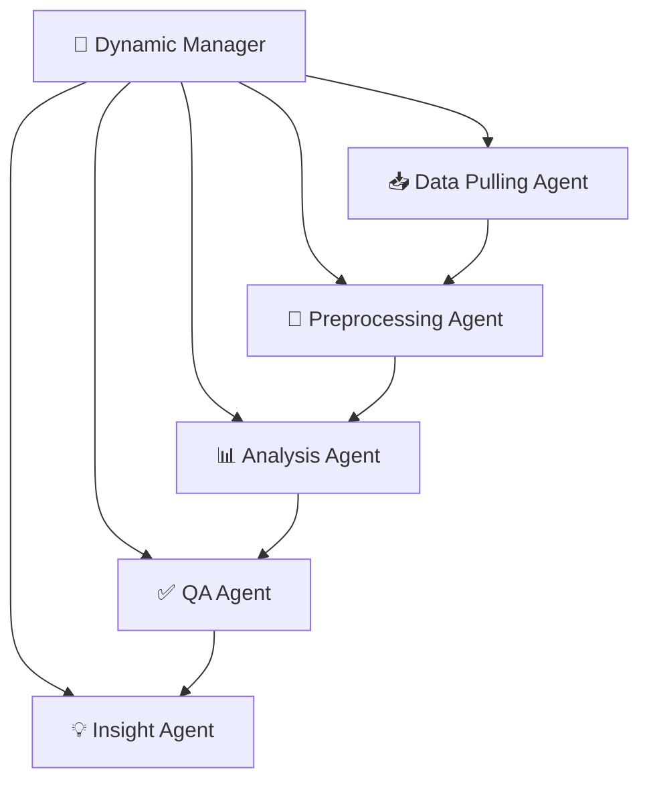

# 🤖 **Dynamic Multi-Agent System - Agent Architecture**

## 🎯 **Overview**

This folder contains the **6 specialized agents** that work together to answer natural language questions about data. The system uses a **dynamic orchestration approach** where the `DynamicManagerController` coordinates other agents based on the specific question asked.

## 🏗️ **Agent Architecture**



| Agent | File | Role | Capabilities |
|-------|------|------|-------------|
| **🧠 Dynamic Manager** | `manager_agent.py` | Question-Answering Orchestrator | NLP understanding, workflow planning, agent coordination |
| **📥 Data Pulling** | `data_pulling_agent.py` | Dynamic Data Retrieval | Database querying, multi-source extraction, schema-aware retrieval |
| **🔧 Preprocessing** | `preprocessing_agent.py` | Adaptive Data Processing | Data cleaning, feature engineering, type conversion |
| **📊 Analysis** | `analysis_agent.py` | Question-Driven Analytics | Statistical analysis, trends, comparisons, predictions |
| **✅ QA** | `qa_agent.py` | Result Validation Expert | Quality assessment, result validation, significance testing |
| **💡 Insight** | `insight_agent.py` | Answer Synthesis Expert | Natural language generation, insights, recommendations |

## 🧠 **DynamicManagerController - The Orchestrator Brain**

The `DynamicManagerController` is the **intelligent orchestrator** that coordinates all other agents. It's built with CrewAI and uses 3 specialized tools to understand questions and plan workflows.

### 🏗️ **Architecture**

```python
class DynamicManagerController:
    def __init__(self):
        self.agent = create_manager_agent()  # CrewAI Agent with GPT-4o
        self.question_cache = {}             # Cache for processed questions
        self.schema_cache = {}               # Cache for database schemas
```

### 🔧 **3 Specialized Tools**

#### **Tool 1: 🧠 QuestionUnderstandingTool**
```python
class QuestionUnderstandingTool(BaseTool):
    name: str = "question_understanding"
    description: str = "Parse natural language questions to extract intent, entities, and analysis requirements"
```

**Capabilities:**
- **Detects question type**: DATA_EXPLORATION, STATISTICAL_SUMMARY, TREND_ANALYSIS, COMPARISON, CORRELATION, PREDICTION
- **Extracts entities**: users, events, revenue, retention, churn, etc.
- **Identifies time filters**: "last month", "2024-01-01 to 2024-01-31", "yesterday"
- **Finds conditions**: "new users", "mobile platform", "premium users"
- **Determines grouping**: "by day", "by country", "by platform"
- **Calculates confidence**: 0.0-1.0 confidence score in understanding

**Example:**
```python
question = "Show me user trends over the last month"
result = {
    "question_type": "TREND_ANALYSIS",
    "entities": ["users"],
    "time_filters": {"period": "last_month"},
    "analysis_methods": ["time_series_analysis"],
    "confidence": 0.9
}
```

#### **Tool 2: 🔍 DatabaseSchemaInspectionTool**
```python
class DatabaseSchemaInspectionTool(BaseTool):
    name: str = "database_schema_inspection"
    description: str = "Inspect database schema to understand available tables, columns, and data"
```

**Capabilities:**
- **Auto-discovers database schema** using SQLAlchemy
- **Gets sample data** from each table (5 rows)
- **Identifies metrics** (numeric columns, counts, rates)
- **Filters relevant tables** based on question entities
- **Suggests common queries** based on schema patterns

**Example:**
```python
entities = ["users"]
result = {
    "database_context": {
        "schemas": [
            {
                "table_name": "users",
                "columns": [
                    {"name": "id", "type": "INTEGER", "nullable": False},
                    {"name": "created_at", "type": "TIMESTAMP", "nullable": False},
                    {"name": "platform", "type": "VARCHAR", "nullable": True}
                ],
                "sample_data": {"columns": [...], "sample_rows": [...]}
            }
        ],
        "available_metrics": ["users.id", "users.created_at"],
        "common_queries": ["SELECT COUNT(*) FROM users", "SELECT DATE(created_at), COUNT(*) FROM users GROUP BY DATE(created_at)"]
    }
}
```

#### **Tool 3: 📋 DynamicTaskPlanningTool**
```python
class DynamicTaskPlanningTool(BaseTool):
    name: str = "dynamic_task_planning"
    description: str = "Create custom agent workflows based on user questions and database context"
```

**Capabilities:**
- **Creates custom workflows** based on question type
- **Estimates execution time** (30 seconds per task)
- **Determines quality checks** needed
- **Calculates plan confidence** (0.0-1.0)

**Example Workflow for Trend Analysis:**
```python
task_plan = [
    {
        "agent": "data_pulling",
        "task": "extract_relevant_data",
        "parameters": {
            "target_tables": ["users"],
            "time_filters": {"period": "last_month"},
            "sample_size": 50000
        }
    },
    {
        "agent": "preprocessing",
        "task": "prepare_for_analysis",
        "parameters": {
            "time_aggregation": "auto",
            "missing_data_strategy": "auto"
        }
    },
    {
        "agent": "analysis",
        "task": "analyze_trends",
        "parameters": {
            "time_column": "timestamp",
            "metrics": ["users"],
            "trend_method": "linear"
        }
    },
    {
        "agent": "qa",
        "task": "validate_analysis_results",
        "parameters": {
            "question_context": "Show me user trends over the last month",
            "expected_output": "summary"
        }
    },
    {
        "agent": "insight",
        "task": "generate_answer",
        "parameters": {
            "question": "Show me user trends over the last month",
            "question_type": "TREND_ANALYSIS",
            "output_format": "summary"
        }
    }
]
```

## 🔄 **Main Workflow: process_user_question()**

The core method that processes any natural language question:

### **Step 1: 🧠 Question Understanding**
```python
# Parse natural language question
question_tool = QuestionUnderstandingTool()
understanding_result = question_tool._run(question_text)

# Create structured UserQuestion object
user_question = UserQuestion(
    question_text=question_text,
    question_type=understanding_result["question_type"],
    entities=understanding_result["entities"],
    time_filters=understanding_result["time_filters"],
    conditions=understanding_result["conditions"],
    grouping=understanding_result["grouping"],
    analysis_methods=understanding_result["analysis_methods"],
    output_format=understanding_result["output_format"]
)
```

### **Step 2: 🔍 Database Schema Inspection**
```python
# Inspect database to understand available data
schema_tool = DatabaseSchemaInspectionTool()
schema_result = schema_tool._run(user_question.entities)

# Create database context
db_context = DatabaseContext(**schema_result["database_context"])

# Update question with relevant tables and columns
user_question.target_tables = [schema.table_name for schema in db_context.schemas]
user_question.required_columns = [
    col["name"] for schema in db_context.schemas for col in schema.columns
    if any(entity in col["name"].lower() for entity in user_question.entities)
]
```

### **Step 3: 📋 Dynamic Task Planning**
```python
# Create custom workflow for this specific question
planning_tool = DynamicTaskPlanningTool()
plan_result = planning_tool._run(user_question, db_context)

# Return complete execution plan
return {
    "status": "success",
    "question": user_question.dict(),
    "database_context": db_context.dict(),
    "task_plan": plan_result["task_plan"],
    "estimated_time": plan_result["estimated_time"],
    "confidence": understanding_result["confidence"]
}
```

## 🎯 **Dynamic Workflow Examples**

The system creates **different workflows** based on question type:

### **Data Exploration**: "What data do we have?"
```python
# Simple workflow - just inspect and report
tasks = [
    {"agent": "insight", "task": "generate_answer"}
]
# Estimated time: 30 seconds
```

### **Statistical Summary**: "How many users are active?"
```python
tasks = [
    {"agent": "data_pulling", "task": "extract_relevant_data"},
    {"agent": "preprocessing", "task": "prepare_for_analysis"},
    {"agent": "analysis", "task": "calculate_summary_statistics"},
    {"agent": "qa", "task": "validate_analysis_results"},
    {"agent": "insight", "task": "generate_answer"}
]
# Estimated time: 150 seconds
```

### **Trend Analysis**: "Show me engagement trends over time"
```python
tasks = [
    {"agent": "data_pulling", "task": "extract_relevant_data"},
    {"agent": "preprocessing", "task": "prepare_for_analysis"},
    {"agent": "analysis", "task": "analyze_trends"},
    {"agent": "qa", "task": "validate_analysis_results"},
    {"agent": "insight", "task": "generate_answer"}
]
# Estimated time: 150 seconds
```

### **Comparison**: "Compare mobile vs web users"
```python
tasks = [
    {"agent": "data_pulling", "task": "extract_relevant_data"},
    {"agent": "preprocessing", "task": "prepare_for_analysis"},
    {"agent": "analysis", "task": "comparative_analysis"},
    {"agent": "qa", "task": "validate_analysis_results"},
    {"agent": "insight", "task": "generate_answer"}
]
# Estimated time: 150 seconds
```

### **Prediction**: "Predict user churn"
```python
tasks = [
    {"agent": "data_pulling", "task": "extract_relevant_data"},
    {"agent": "preprocessing", "task": "prepare_for_analysis"},
    {"agent": "analysis", "task": "predictive_modeling"},
    {"agent": "qa", "task": "validate_analysis_results"},
    {"agent": "insight", "task": "generate_answer"}
]
# Estimated time: 180 seconds (complex analysis)
```

## 🔍 **Question Understanding Intelligence**

### **Pattern Matching for Question Types**
```python
def _detect_question_type(self, question: str) -> QuestionType:
    # Data exploration patterns
    if any(pattern in question for pattern in [
        "what data", "show me data", "available data", "tables", "columns"
    ]):
        return QuestionType.DATA_EXPLORATION
    
    # Statistical summary patterns
    elif any(pattern in question for pattern in [
        "summary", "average", "total", "count", "mean", "statistics"
    ]):
        return QuestionType.STATISTICAL_SUMMARY
    
    # Trend analysis patterns
    elif any(pattern in question for pattern in [
        "trend", "over time", "change", "growth", "decline", "monthly", "daily"
    ]):
        return QuestionType.TREND_ANALYSIS
    
    # Comparison patterns
    elif any(pattern in question for pattern in [
        "compare", "vs", "versus", "difference", "between", "against"
    ]):
        return QuestionType.COMPARISON
    
    # Correlation patterns
    elif any(pattern in question for pattern in [
        "correlate", "relationship", "factors", "influence", "affect"
    ]):
        return QuestionType.CORRELATION
    
    # Prediction patterns
    elif any(pattern in question for pattern in [
        "predict", "forecast", "future", "churn", "likely to", "probability"
    ]):
        return QuestionType.PREDICTION
```

### **Entity Extraction**
```python
entity_patterns = {
    "users": ["user", "users", "customer", "customers"],
    "events": ["event", "events", "activity", "activities", "action", "actions"],
    "sessions": ["session", "sessions", "visit", "visits"],
    "revenue": ["revenue", "sales", "purchase", "purchases", "money"],
    "time": ["time", "date", "timestamp", "when", "day", "month", "year"],
    "retention": ["retention", "return", "comeback", "stay"],
    "engagement": ["engagement", "activity", "usage", "behavior"],
    "conversion": ["conversion", "convert", "funnel", "complete"],
    "churn": ["churn", "leave", "quit", "uninstall"]
}
```

## 🗄️ **Database Schema Intelligence**

### **Automatic Schema Discovery**
```python
def _run(self, entities: List[str] = None) -> Dict[str, Any]:
    # Connect to database using SQLAlchemy
    engine = sa.create_engine(settings.database.url)
    inspector = inspect(engine)
    
    # Discover all tables
    table_names = inspector.get_table_names()
    
    # Build detailed schema information
    for table_name in table_names:
        columns = inspector.get_columns(table_name)
        sample_data = self._get_sample_data(engine, table_name)
        
        schema = DatabaseSchema(
            table_name=table_name,
            columns=[{
                "name": col["name"],
                "type": str(col["type"]),
                "nullable": col["nullable"]
            } for col in columns],
            sample_data=sample_data
        )
```

### **Metric Identification**
```python
def _identify_metrics(self, schemas: List[DatabaseSchema]) -> List[str]:
    metrics = []
    
    for schema in schemas:
        for col in schema.columns:
            col_name = col["name"].lower()
            col_type = col["type"].lower()
            
            # Identify common metric patterns
            if "count" in col_name or "total" in col_name:
                metrics.append(f"{schema.table_name}.{col['name']}")
            elif "revenue" in col_name or "amount" in col_name:
                metrics.append(f"{schema.table_name}.{col['name']}")
            elif col_type in ["integer", "float", "decimal", "numeric"]:
                metrics.append(f"{schema.table_name}.{col['name']}")
    
    return metrics
```

## 💡 **Question Suggestion System**

```python
def suggest_questions(self, db_context: DatabaseContext) -> List[str]:
    suggestions = []
    
    for schema in db_context.schemas:
        table_name = schema.table_name
        
        # Basic exploration questions
        suggestions.append(f"What data is available in {table_name}?")
        suggestions.append(f"Show me a summary of {table_name}")
        
        # Time-based questions if timestamp columns exist
        timestamp_cols = [col["name"] for col in schema.columns 
                        if "timestamp" in col["name"].lower() or "date" in col["name"].lower()]
        if timestamp_cols:
            suggestions.append(f"How has {table_name} activity changed over time?")
            suggestions.append(f"What are the trends in {table_name}?")
        
        # User-related questions
        if "user" in table_name.lower():
            suggestions.append(f"How many users are active?")
            suggestions.append(f"What is user retention like?")
            suggestions.append(f"Compare user behavior by segment")
    
    return suggestions[:10]  # Limit to top 10 suggestions
```

## 🎭 **CrewAI Agent Integration**

The manager uses CrewAI framework with GPT-4o:

```python
def create_manager_agent() -> Agent:
    # Initialize the 3 specialized tools
    question_tool = QuestionUnderstandingTool()
    schema_tool = DatabaseSchemaInspectionTool()
    planning_tool = DynamicTaskPlanningTool()
    
    # Create CrewAI agent
    manager_agent = Agent(
        role="Dynamic Question-Answering Manager",
        goal="""
        As a Dynamic Question-Answering Manager, I am responsible for:
        1. Understanding natural language questions from users
        2. Inspecting database schema to understand available data
        3. Creating custom workflows to answer specific questions
        4. Coordinating multi-agent execution based on question requirements
        5. Ensuring accurate and relevant answers to user questions
        """,
        backstory="""
        I am an intelligent data analysis orchestrator with expertise in natural language 
        understanding and dynamic workflow planning. I can interpret various types of questions 
        about data and coordinate specialized agents to provide accurate, insightful answers. 
        I adapt my approach based on the specific question and available data sources.
        """,
        tools=[question_tool, schema_tool, planning_tool],
        verbose=settings.agent.verbose,
        allow_delegation=False,
        max_execution_time=settings.agent.max_execution_time,
        llm_config={
            "model": settings.openai.model,      # GPT-4o
            "temperature": settings.openai.temperature,
            "max_tokens": settings.openai.max_tokens
        }
    )
    
    return manager_agent
```

## 🔄 **Complete Example: Question Processing**

**User asks**: *"Show me user trends over the last month"*

### **1. Question Understanding Result**
```python
{
    "question_type": "TREND_ANALYSIS",
    "entities": ["users"],
    "time_filters": {"period": "last_month"},
    "conditions": [],
    "grouping": [],
    "analysis_methods": ["time_series_analysis", "trend_calculation"],
    "output_format": "summary",
    "confidence": 0.9
}
```

### **2. Database Schema Result**
```python
{
    "database_context": {
        "schemas": [
            {
                "table_name": "users",
                "columns": [
                    {"name": "id", "type": "INTEGER", "nullable": False},
                    {"name": "created_at", "type": "TIMESTAMP", "nullable": False},
                    {"name": "last_active", "type": "TIMESTAMP", "nullable": True},
                    {"name": "platform", "type": "VARCHAR", "nullable": True}
                ],
                "sample_data": {
                    "columns": ["id", "created_at", "last_active", "platform"],
                    "sample_rows": [
                        {"id": 1, "created_at": "2024-01-15T10:30:00", "last_active": "2024-01-20T15:45:00", "platform": "mobile"},
                        {"id": 2, "created_at": "2024-01-16T14:20:00", "last_active": "2024-01-21T09:15:00", "platform": "web"}
                    ]
                }
            }
        ],
        "available_metrics": ["users.id", "users.created_at", "users.last_active"],
        "common_queries": [
            "SELECT COUNT(*) FROM users",
            "SELECT DATE(created_at) as date, COUNT(*) FROM users GROUP BY DATE(created_at)"
        ]
    },
    "total_tables": 1,
    "relevant_tables": 1
}
```

### **3. Dynamic Task Plan Result**
```python
{
    "task_plan": [
        {
            "agent": "data_pulling",
            "task": "extract_relevant_data",
            "parameters": {
                "target_tables": ["users"],
                "columns": ["id", "created_at", "last_active", "platform"],
                "time_filters": {"period": "last_month"},
                "conditions": [],
                "sample_size": 50000
            }
        },
        {
            "agent": "preprocessing",
            "task": "prepare_for_analysis",
            "parameters": {
                "grouping": [],
                "time_aggregation": "auto",
                "missing_data_strategy": "auto"
            }
        },
        {
            "agent": "analysis",
            "task": "analyze_trends",
            "parameters": {
                "time_column": "timestamp",
                "metrics": ["users"],
                "trend_method": "linear"
            }
        },
        {
            "agent": "qa",
            "task": "validate_analysis_results",
            "parameters": {
                "question_context": "Show me user trends over the last month",
                "expected_output": "summary"
            }
        },
        {
            "agent": "insight",
            "task": "generate_answer",
            "parameters": {
                "question": "Show me user trends over the last month",
                "question_type": "TREND_ANALYSIS",
                "output_format": "summary"
            }
        }
    ],
    "estimated_time": 150,
    "quality_checks": ["data_completeness", "result_validity", "temporal_consistency"],
    "plan_confidence": 0.9
}
```

## 🛠️ **Key Features**

- **🧠 Natural Language Understanding**: Parses complex questions intelligently using pattern matching and entity extraction
- **🔍 Schema-Aware**: Automatically adapts to any database structure using SQLAlchemy inspection
- **📋 Dynamic Planning**: Creates custom workflows for each question type and complexity
- **🎭 AI-Powered**: Uses GPT-4o for intelligent orchestration and decision making
- **⚡ Caching**: Caches questions and schemas for improved performance
- **🛡️ Error Handling**: Graceful fallbacks and comprehensive error recovery
- **📊 Confidence Scoring**: Provides confidence metrics for understanding and planning
- **💡 Smart Suggestions**: Generates relevant questions based on available data

## 🔧 **Development Notes**

### **Adding New Question Types**
1. Add to `QuestionType` enum in `data_models.py`
2. Add detection patterns in `_detect_question_type()`
3. Add analysis methods in `_determine_analysis_methods()`
4. Add task plan logic in `_create_task_plan()`

### **Extending Entity Recognition**
Add new patterns to the `entity_patterns` dictionary in `_extract_entities()`:
```python
entity_patterns = {
    "your_new_entity": ["pattern1", "pattern2", "pattern3"],
    # ... existing patterns
}
```

### **Custom Database Adapters**
Extend `DatabaseSchemaInspectionTool` to support new database types or custom schemas.

### **Performance Optimization**
- Enable caching for frequently asked questions
- Implement connection pooling for database operations
- Add async support for parallel agent execution

---

**The DynamicManagerController is the intelligent brain that makes this multi-agent system truly dynamic and adaptive!** 🚀 